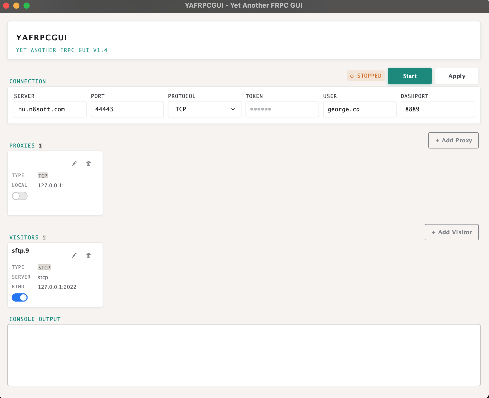

# YAFRPCGUI - Yet Another FRPC GUI

A lightweight, modern graphical user interface designed for [FRP (Fast Reverse Proxy)](https://github.com/fatedier/frp). Built elegantly with native HTML, JS, and CSS using modern [Sciter](https://sciter.com/) UI technologies.

## Overview

YAFRPCGUI simplifies the management of your FRPC client. It allows users to visually configure proxies and visitors without the hassle of manually editing configuration files or keeping command-line instances open.

**Key Features:**
- Seamless configuration of FRPC proxies and visitors.
- Convenient one-click start/stop controls for the FRPC service.
- Easy toggle switches to quickly enable or disable individual proxies and visitors.

## Motivation

Managing reverse proxies via CLI can be tedious. This tool was created to address several friction points:
1. **Configuration Management:** Editing raw configuration files and manually restarting background services is inefficient.
2. **Background Execution:** It eliminates the need to keep persistent terminal windows running in the background.
3. **Context Switching:** Provides an easy way to manage and toggle multiple isolated proxy configurations dedicated to different purposes.

## Installation & Usage

**Prerequisites:** You must have the corresponding `frpc` executable placed alongside the application binary in order to run. 
*Note for macOS users: Place the downloaded `frpc` binary inside the `yafrpcgui.app/Contents/MacOSX/` directory.*

The latest version of FRPC can be downloaded from the [FRP releases page](https://github.com/fatedier/frp/releases).

### Running from Source
1. Download and install the [Sciter SDK](https://sciter.com/download/).
2. Open `usciter` (or the equivalent executable for your OS) and load `src/main.htm` to launch the application.

### Building Standalone Executables
To compile a standalone binary (e.g., an `.exe` or macOS `.app`), use the **Quark** packaging tool bundled within the Sciter SDK:
1. Open the Quark application.
2. Load the included `quark_project.json` configuration file, or specify the packaging details manually and point the resource folder to the `src` directory.
3. Execute the build process.

## Changelog

**2026-02-23 (v1.4)**
- Replaced the `xterm.js` terminal dependency with a lightweight plaintext log.
- Introduced UI consistency updates to layout dimensions and styling.
- Implemented dynamic evaluation logic to cleanly resolve the local `frpc` executable path.
- Added Quark project configuration (`quark_project.json`) for streamlined macOS and Windows builds.

**2024-10-23**
- Added support for token authentication.
- Disabled the web server port UI element dynamically during active runs.
- Enhanced layout flow for better scaling when managing large numbers of proxies or visitors.
