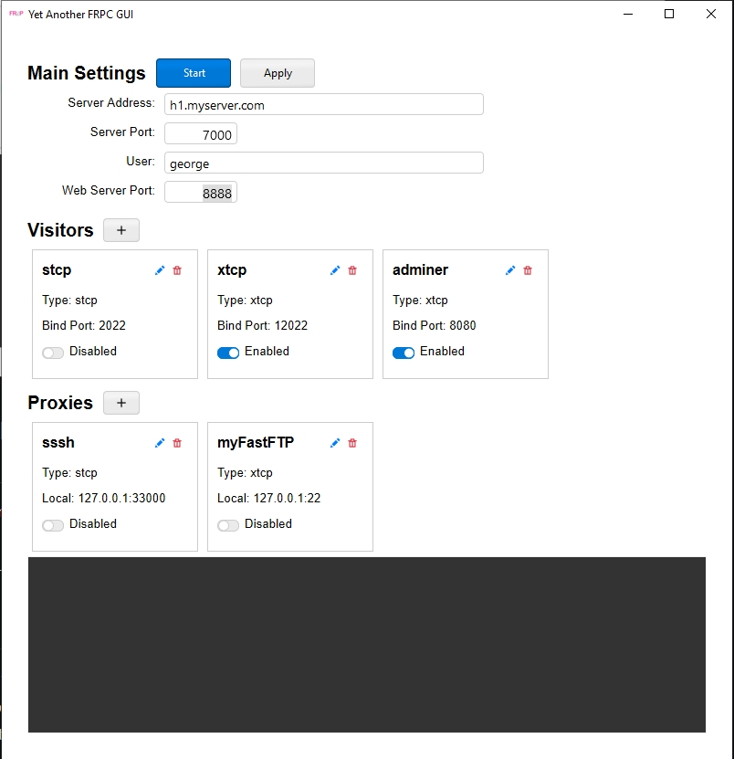

# Yet Another FRPC GUI

Backed by [Sciter](https://sciter.com/) and [FRP](https://github.com/fatedier/frp)

## This is a simple GUI for FRPC, which can help you to manage your FRP client easily.
It supports configuring frpc proxy, visitor. You can also start/stop the frpc service, enable/disable the proxies and visitors.

Basically, it's some HTM/JS files running in Sciter.

## Why this?
1. I use frpc under windows, it's painful to edit the config file, and restart the service.
2. I don't like the black window of cmd keeps running.
3. I have many visitors/proxies configured, each for different purposes, it's hard to enable/disable everytime.

## How to build or run:
1. Install Sciter SDK from https://sciter.com/download/
2. Launch usciter.exe, then load main.htm - that's all.

If you want to build an exe, run quark from sciter SDK, specify information, point resource folder to src, then build.

## Note:
1. In order to run it, you should put frpc executable in the same directory as the exe. For macOS, You should put it into yafrpcgui.app/Contents/MacOSX/.
You can download the latest frpc from https://github.com/fatedier/frp/releases.

## Change Log
1. 2024-10-23: 
    Add token auth support.
    Disable webserver port after running.
    Change layout so it won't become so messy when there are many proxies or visitors.
2. 2026-02-23:
    Replace xterm.js terminal with plaintext log.
    Update UI.
    Add frpc executable location logic.
    Add Quark project configuration.
    Build for macOS and Windows.
